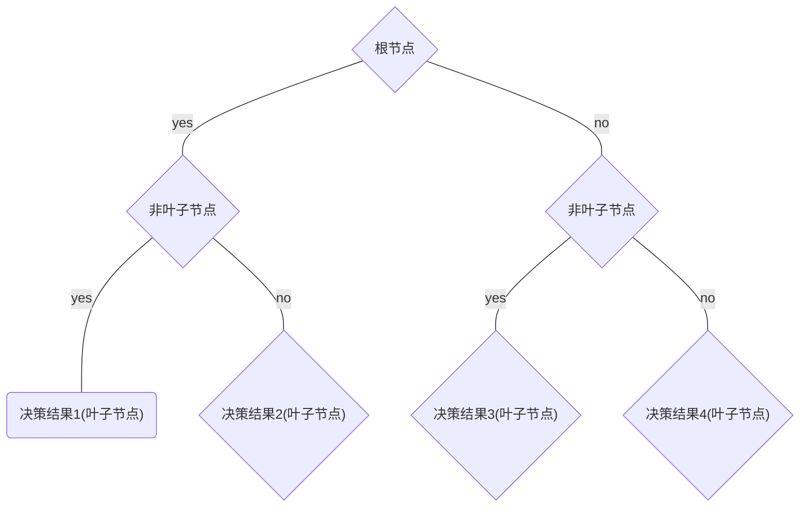

 # 决策树模型
- [决策树模型](#决策树模型)
  - [1. 决策树核心思想](#1-决策树核心思想)
    - [1.1. 决策树判断](#11-决策树判断)
    - [1.2. 决策树构建](#12-决策树构建)
    - [1.3. 决策树的剪枝](#13-决策树的剪枝)
      - [1.3.1. 预剪枝：易欠拟合 训练时间短](#131-预剪枝易欠拟合-训练时间短)
      - [1.3.2. 后剪枝：难欠拟合 训练时间长](#132-后剪枝难欠拟合-训练时间长)
  - [2. 基本树](#2-基本树)
    - [2.1. ID3](#21-id3)
      - [2.1.1. 思想](#211-思想)
      - [2.1.2. 划分标准：信息增益](#212-划分标准信息增益)
      - [2.1.3. 缺点](#213-缺点)
    - [2.2. C4.5](#22-c45)
      - [2.2.1. 思想](#221-思想)
      - [2.2.2. 划分标准：先信息增益率后信息增益](#222-划分标准先信息增益率后信息增益)
      - [2.2.3. 剪枝策略](#223-剪枝策略)
      - [2.2.4. 缺点](#224-缺点)
    - [2.3. CART](#23-cart)
      - [2.3.1. 思想](#231-思想)
      - [2.3.2. 划分标准：基尼指数](#232-划分标准基尼指数)
      - [2.3.3. 待续](#233-待续)
  - [3. 基于集成学习的决策树](#3-基于集成学习的决策树)
    - [3.1. 基于 Boosting (提高)框架的主流集成算法](#31-基于-boosting-提高框架的主流集成算法)
      - [3.1.1. Adaboost算法](#311-adaboost算法)
      - [3.1.2. GBDT算法](#312-gbdt算法)
      - [3.1.3. XGBoost算法](#313-xgboost算法)
        - [3.1.3.1. 算法属性](#3131-算法属性)
      - [3.1.4. CatBoost算法](#314-catboost算法)
      - [3.1.5. LightGBM算法](#315-lightgbm算法)
    - [3.2. 基于 Bagging(装袋)框架的主流集成算法](#32-基于-bagging装袋框架的主流集成算法)
      - [3.2.1. Random Forest](#321-random-forest)
    - [3.3. Stacking(堆叠)框架使用](#33-stacking堆叠框架使用)
## 1. 决策树核心思想
### 1.1. 决策树判断
决策树（decision tree）是一个树结构（可以是二叉树或非二叉树）。  
其每个非叶节点表示一个特征的条件判定，每个分支代表这个特征条件判断的结果，而每个叶节点存放一个决策结果。  
使用决策树进行决策的过程就是从根节点开始，测试待分类项中相应的特征属性，并按照其值选择输出分支，直到到达叶子节点，将叶子节点存放的类别作为决策结果。  

**决策树就是可以看做一个if-then规则的集合。我们从决策树的根结点到每一个都叶结点构建一条规则。并且我们将要预测的实例都可以被一条路径或者一条规则所覆盖。**  

决策树的判定过程就相当于树中从根结点到某一个叶子结点的遍历。每一步如何遍历是由数据各个特征的具体特征属性决定。
### 1.2. 决策树构建
从根节点开始，每一次子节点的产生，是由于在当前层数选择了不同的特征作为分裂因素。  
每一层选择了指定的特征之后，我们就可以继续由该特征的不同属性值进行划分，依次一直到叶子结点。  
以什么标准来决定每层的选择特征？这就是决策树的关键步骤——**分裂属性**。  
所谓分裂属性就是在某个节点处按照某一特征属性的不同划分构造不同的分支，其目标是让各个分裂子集尽可能地“纯”。尽可能“纯”就是尽量让一个分裂子集中待分类项属于同一类别。分裂子集越纯，我们需要划分此子集所用的步骤也就越少。
而判断“纯”的方法不同引出了我们的ID3算法，C4.5算法以及CART算法

### 1.3. 决策树的剪枝
剪枝的目的是改善过拟合问题，提高决策树泛化能力

#### 1.3.1. 预剪枝：易欠拟合 训练时间短
在节点划分前来确定是否继续增长，及早停止增长的主要方法有：

1. 节点内数据样本低于某一阈值；
2. 所有节点特征都已分裂；
3. 节点划分前准确率比划分后准确率高。

预剪枝不仅可以降低过拟合的风险而且还可以减少训练时间，但另一方面它是基于“贪心”策略，会带来欠拟合风险。

#### 1.3.2. 后剪枝：难欠拟合 训练时间长
在已经生成的决策树上进行剪枝，从而得到简化版的剪枝决策树。

后剪枝决策树的欠拟合风险很小，泛化性能往往优于预剪枝决策树。但同时其训练时间会大的多。

## 2. 基本树
### 2.1. ID3
ID3 算法是建立在奥卡姆剃刀（用较少的东西，同样可以做好事情）的基础上：越是小型的决策树越优于大的决策树
#### 2.1.1. 思想
ID3 算法的核心思想就是以信息增益来度量特征选择，选择**信息增益最大**(**信息不确定性减少的程度最大**)的特征进行分裂。算法采用自顶向下的贪婪搜索遍历可能的决策树空间，其大致步骤为：
1. 初始化特征集合和数据集合；
2. 计算数据集合信息熵和所有特征的条件熵，选择信息增益最大的特征作为当前决策节点；
3. 更新数据集合和特征集合（删除上一步使用的特征，并按照特征值来划分不同分支的数据集合）；
4. 重复 2，3 两步，若子集值包含单一特征，则为分支叶子节点。

#### 2.1.2. 划分标准：信息增益
信息熵：
$$Ent(D) = -\sum_{k=1}^{|y|}p_k log_2 p_k$$
信息增益 = 信息熵 - 条件熵
$$Gain(D,feature) = Ent(D) - \sum^{v}_{v=1}\frac{D^v}{D}Ent(D^v)$$

**计算例子**：
正例(好瓜)占 8/17，反例占 9/17 ，根结点的信息熵为  
$$Ent(D) = -\sum_{k=1}^{2}p_k log_2 p_k = -(\frac{8}{17} log_2 \frac{8}{17}+\frac{9}{17}log_2 \frac{9}{17}) = 0.998$$

特征一有3个可能取值
D1(特征一=1) = {1, 4, 6, 10, 13, 17}，正例 3/6，反例 3/6
信息熵为：$Ent(D) = -(\frac{3}{6} log_2 \frac{3}{6}+\frac{3}{6} log_2 \frac{3}{6}) = 1.000$

D2(特征一=2) = {2, 3, 7, 8, 9, 15}，正例 4/6，反例 2/6
信息熵为：$Ent(D) = -(\frac{4}{6} log_2 \frac{4}{6}+\frac{2}{6} log_2 \frac{2}{6}) = 0.918$

D3(特征一=3) = {5, 11, 12, 14, 16}，正例 1/5，反例 4/5
信息熵为：$Ent(D) = -(\frac{1}{5} log_2 \frac{1}{5}+\frac{4}{5} log_2 \frac{4}{5}) = 0.722$

特征一的信息增益为：
$$
\begin{aligned}
Gain(D,feature1) & = Ent(D) - \sum^{3}_{v=1}\frac{D^v}{D}Ent(D^v)  \\
& = 0.998 - (\frac{6}{17}\times1.000+\frac{6}{17}\times0.918+\frac{5}{17}\times0.722) \\
&=0.109\\
\end{aligned}
$$
找出所有特征中信息增益最大的特征，作为分类节点
#### 2.1.3. 缺点
1. 过拟合：ID3 没有剪枝策略，容易过拟合；
2. 泛化差：信息增益准则对可取值数目较多的特征有所偏好，类似“编号”的特征其信息增益接近于 1，泛化能力低；
3. 局限大：只能用于处理离散分布的特征；
4. 不周全：没有考虑缺失值。

### 2.2. C4.5
C4.5 算法最大的特点是克服了 ID3 对特征数目的偏重这一缺点，引入信息增益率来作为分类标准。

#### 2.2.1. 思想
C4.5 相对于 ID3 的缺点对应有以下改进方式：

* 引入悲观剪枝策略进行后剪枝；
* 引入信息增益率作为划分标准；
* 将连续特征离散化，假设 n 个样本的连续特征 A 有 m 个取值，C4.5 将其排序并取相邻两样本值的平均数共 m-1 个划分点，分别计算以该划分点作为二元分类点时的信息增益，并选择信息增益最大的点作为该连续特征的二元离散分类点；
* 对于缺失值的处理可以分为两个子问题：
  * 问题一：在特征值缺失的情况下进行划分特征的选择？（即如何计算特征的信息增益率）
  * 针对问题一，C4.5 的做法是：对于具有缺失值特征，用没有缺失的样本子集所占比重来折算；
  * 问题二：选定该划分特征，对于缺失该特征值的样本如何处理？（即到底把这个样本划分到哪个结点里）
  * 针对问题二，C4.5 的做法是：将样本同时划分到所有子节点，不过要调整样本的权重值，其实也就是以不同概率划分到不同节点中。

#### 2.2.2. 划分标准：先信息增益率后信息增益
信息增益率公式：
$$
\begin{aligned}
Gain_ratio(D,a)&=\frac{Gain(D,a)}{IV(a)} \\
IV(a)&=-\sum^{V}_{v=1}\frac{D^v}{D}log_2\frac{D^v}{D}\\
\end{aligned}
$$
$IV(a)$称为特征 A 的固有值。
信息增益率对可取值较少的特征有所偏好（分母越小，整体越大）

C4.5 并不是直接用增益率最大的特征进行划分，而是使用一个启发式方法：
候选划分属性中找出信息增益高于平均水平的属性（这样保证了大部分好的的特征），再从中选择增益率最高的（又保证了不会出现编号特征这种极端的情况）

#### 2.2.3. 剪枝策略
C4.5 采用的悲观剪枝方法，用递归的方式从低往上针对每一个非叶子节点，评估用一个最佳叶子节点去代替这课子树是否有益。如果剪枝后与剪枝前相比其错误率是保持或者下降，则这棵子树就可以被替换掉。C4.5 通过训练数据集上的错误分类数量来估算未知样本上的错误率。

#### 2.2.4. 缺点

* 需优化：剪枝策略可以再优化；
* 效率低：C4.5 用的是多叉树，用二叉树效率更高；
* 功能少：C4.5 只能用于分类；
* 运算多：C4.5 使用的熵模型拥有大量耗时的对数运算，连续值还有排序运算；
* 耗内存：C4.5 在构造树的过程中，对数值属性值需要按照其大小进行排序，从中选择一个分割点，所以只适合于能够驻留于内存的数据集，当训练集大得无法在内存容纳时，程序无法运行。

### 2.3. CART
ID3 和 C4.5 虽然在对训练样本集的学习中可以尽可能多地挖掘信息，但是其生成的决策树分支、规模都比较大，CART 算法的二分法可以简化决策树的规模，提高生成决策树的效率。
#### 2.3.1. 思想
CART 包含的基本过程有分裂，剪枝和树选择。

* 分裂：分裂过程是一个二叉递归划分过程，其输入和预测特征既可以是连续型的也可以是离散型的，CART 没有停止准则，会一直生长下去；
* 剪枝：采用代价复杂度剪枝，从最大树开始，每次选择训练数据熵对整体性能贡献最小的那个分裂节点作为下一个剪枝对象，直到只剩下根节点。CART 会产生一系列嵌套的剪枝树，需要从中选出一颗最优的决策树；
* 树选择：用单独的测试集评估每棵剪枝树的预测性能（也可以用交叉验证）。

CART 在 C4.5 的基础上进行了很多提升。

* C4.5 为多叉树，运算速度慢，CART 为二叉树，运算速度快；
* C4.5 只能分类，CART 既可以分类也可以回归；
* CART 使用 Gini 系数作为变量的不纯度量，减少了大量的对数运算；
* CART 采用代理测试来估计缺失值，而 C4.5 以不同概率划分到不同节点中；
* CART 采用“基于代价复杂度剪枝”方法进行剪枝，而 C4.5 采用悲观剪枝方法。

#### 2.3.2. 划分标准：基尼指数
熵模型拥有大量耗时的对数运算，基尼指数在简化模型的同时还保留了熵模型的优点。基尼指数代表了模型的不纯度，基尼系数越小，不纯度越低，特征越好。这和信息增益（率）正好相反。
$$
\begin{aligned}
Gini(D)&=\sum^{K}_{k=1}\frac{|C_k|}{|D|}(1-\frac{|C_k|}{|D|})\\
&=1-\sum^{K}_{k=1}(\frac{|C_k|}{|D|})^2\\
Gini(D|A)&=\sum^{n}_{i=1}\frac{|D_i|}{|D|}Gini(D_i)
\end{aligned}
$$
其中 k 代表类别。  
基尼指数与熵模型性能接近，基尼指数可以理解为熵模型的一阶泰勒展开
($ln(x)=-1+x+o(x)$)。

$$
\begin{aligned}
Ent(D) &= -\sum_{k=1}^{|y|}p_k log_2 p_k\\
&\approx\sum_{k=1}^{|y|}p_k(1-p_k)\\
\end{aligned}
$$

#### 2.3.3. 待续
## 3. 基于集成学习的决策树
常见的集成学习框架有三种：Bagging，Boosting 和 Stacking。三种集成学习框架在基学习器的产生和综合结果的方式上会有些区别

**Bagging**：Bagging 全称叫 Bootstrap aggregating，看到 Bootstrap 会想到 Bootstrap 抽样方法），Bagging也是抽样，每个基学习器都会对训练集进行有放回抽样得到子训练集，比较著名的采样法为 0.632 自助法。每个基学习器基于不同子训练集进行训练，并综合所有基学习器的预测值得到最终的预测结果。Bagging 常用的综合方法是投票法，票数最多的类别为预测类别。

**Boosting**：Boosting 训练过程为阶梯状，基模型的训练是有顺序的，每个基模型都会在前一个基模型学习的基础上进行学习，最终综合所有基模型的预测值产生最终的预测结果，用的比较多的综合方式为加权法。

**Stacking**：Stacking 是先用全部数据训练好基模型，然后每个基模型都对每个训练样本进行的预测，其预测值将作为训练样本的特征值，最终会得到新的训练样本，然后基于新的训练样本进行训练得到模型，然后得到最终预测结果。

集成学习会优于单个学习器的原因：

1. 训练样本可能无法选择出最好的单个学习器，由于没法选择出最好的学习器，所以干脆结合起来一起用；
2. 假设能找到最好的学习器，但由于算法运算的限制无法找到最优解，只能找到次优解，采用集成学习可以弥补算法的不足；
3. 可能算法无法得到最优解，而集成学习能够得到近似解。比如说最优解是一条对角线，而单个决策树得到的结果只能是平行于坐标轴的，但是集成学习可以去拟合这条对角线。
### 3.1. 基于 Boosting (提高)框架的主流集成算法
#### 3.1.1. Adaboost算法
AdaBoost 是第一个为二分类问题开发的真正成功的 Boosting 算法。它是人们入门理解 Boosting 的最佳起点。当下的 Boosting 方法建立在 AdaBoost 基础之上，最著名的就是随机梯度提升机。
#### 3.1.2. GBDT算法
GBDT中的树是回归树（不是分类树），GBDT用来做回归预测，调整后也可以用于分类。
#### 3.1.3. XGBoost算法
##### 3.1.3.1. 算法属性
模型类型：
    分类模型，
    决策树模型
    判别类模型：不关心数据是怎么生成的，只关心数据之间的差别，然后用差别来简单对给定的一个数据进行分类  

监督学习算法

损失函数：

非参数模型？
#### 3.1.4. CatBoost算法
#### 3.1.5. LightGBM算法

### 3.2. 基于 Bagging(装袋)框架的主流集成算法
#### 3.2.1. Random Forest
随机森林是bagging的一个变体
### 3.3. Stacking(堆叠)框架使用